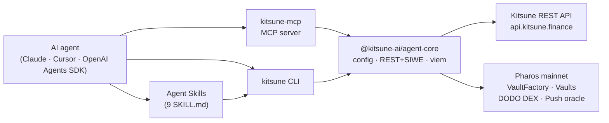

<div align="center">

# 🦊 Kitsune Agent Trade Kit

**The agent toolkit for [Kitsune](https://kitsune.finance) on Pharos.**
Let your AI agent read markets, manage vaults, and run DCA / grid strategies on-chain — in natural language.


</div>

---

> ### 🏆 Built for the Pharos *Skill-to-Agent Dual Cascade* Hackathon
> A **production toolkit live on Pharos mainnet** — 9 **reusable, composable** Agent Skills plus an MCP
> server, CLI, and shared core. Each Skill is a self-contained building block; chain them together and an
> AI agent goes from reading a market to running an on-chain DCA strategy, all in natural language.

---

## ⚡ Try it in 30 seconds (no wallet)

Point any MCP client at the **hosted, read-only** endpoint — no install, no private key. You get the
**8 public market tools** (prices, candles, indicators, DODO pools, backtests) with zero setup:

```bash
# Claude Code — HTTP transport
claude mcp add --transport http kitsune https://mcp.kitsune.finance/mcp
```

```jsonc
// Cursor / VS Code / any URL-capable MCP client:
{ "mcpServers": { "kitsune": { "url": "https://mcp.kitsune.finance/mcp" } } }
```

The hosted server speaks MCP over **Streamable HTTP** at `/mcp`. It is force-hardened to read-only with no
key, so it's the fastest way to try the kit. For vaults, strategies and trades, run it locally — see
[Quick Start](#quick-start).

---

## What is this?

Kitsune Agent Trade Kit connects AI assistants directly to the **Kitsune** automated-trading protocol on
**Pharos** (mainnet by default; the Atlantic testnet is also supported). Instead of clicking through a dApp, you describe what you want — the agent
executes it: check a price, spin up a vault, launch a DCA strategy, read your PnL, or copy a strategy from
the marketplace.

It runs as a **local process**. Your private key never leaves your machine — sign-in (SIWE) and on-chain
transactions are signed **locally** with [viem](https://viem.sh). Fully open source under the MIT license.

It ships as **three standalone pieces around one shared core**, mirroring the OKX Agent Trade Kit design:

| Package | What it is |
|---|---|
| **`@kitsune-ai/agent-mcp`** (`kitsune-mcp`) | An [MCP](https://modelcontextprotocol.io) server. Plug into Claude, Cursor, VS Code, Windsurf, or any MCP client — your agent calls Kitsune tools by natural language. |
| **`@kitsune-ai/agent-cli`** (`kitsune`) | A terminal CLI. Works with shell pipes, cron, and scripts — no AI client needed. Also the runtime behind the Skills. |
| **`@kitsune-ai/agent-core`** | The shared library: config, REST client (SIWE/JWT), viem chain layer, and the single tool catalog used by both the MCP server and the CLI. |

Plus **9 plug-and-play Skills** for clients that support the Agent Skills protocol.

### Architecture



```text
AI agent  →  Skills / MCP server / CLI  →  @kitsune-ai/agent-core  →  Kitsune REST API
(Claude,                                   (REST + SIWE, viem)          + Pharos mainnet
 Cursor,                                                                  (VaultFactory,
 OpenAI)                                                                   vaults, DODO,
                                                                          oracle)
```

---

## Features

| Feature | Details |
|---|---|
| **47 tools across 9 modules** | market · vault · strategy · portfolio · marketplace · executor · referral · fees · notifications |
| **Market data** | prices, OHLCV candles, technical indicators (RSI/MACD/EMA/Bollinger), DODO pools, backtests |
| **Vaults** | list, balances, allocations, create, withdraw |
| **Strategies** | DCA / grid lifecycle — create, update, pause, resume, withdraw, plus trades, metrics & positions |
| **Portfolio** | aggregated PnL, vault activity, leaderboard |
| **Marketplace** | browse, share, copy, and delist strategies |
| **Self-custody** | keys stay local; SIWE + on-chain txs signed on your machine |
| **Safety rails** | read-only mode, signer-gated tools, `[CAUTION]` labels, multi-chain (mainnet + testnet) |

---

## Modules

| Module | Tools | Skill | Auth |
|---|---|---|---|
| `market` | 6 | `kitsune-market` | public (backtest & DODO route need sign-in) |
| `vault` | 5 | `kitsune-vault` | sign-in / signer |
| `strategy` | 15 | `kitsune-strategy` | sign-in / signer |
| `portfolio` | 3 | `kitsune-portfolio` | sign-in (leaderboard public) |
| `marketplace` | 5 | `kitsune-marketplace` | public / sign-in |
| `executor` | 3 | `kitsune-executor` | sign-in |
| `referral` | 4 | `kitsune-referral` | public (resolve) / sign-in |
| `fees` | 2 | `kitsune-fees` | sign-in |
| `notifications` | 4 | `kitsune-notifications` | sign-in |

> **Auth legend** — `public`: no credentials · `sign-in` (jwt): a local SIWE sign-in (needs a private key) ·
> `signer`: sends an on-chain transaction (needs a private key).

---

## Quick Start

### 1. Install

```bash
npm install -g @kitsune-ai/agent-mcp @kitsune-ai/agent-cli
```

Or build from source:

```bash
git clone https://github.com/vi11abajo/kitsune-agent
cd kitsune-agent
corepack pnpm install
corepack pnpm -r build
```

Verify (market data works with no credentials):

```bash
kitsune market price BTC USDT
# from source: node packages/cli/dist/index.js market price BTC USDT
```

### 2. Add your credentials (only needed for vault / strategy actions)

The interactive way is to create `~/.kitsune/config.toml`:

```toml
default_profile = "mainnet"

[profiles.mainnet]
api_url     = "https://api.kitsune.finance/api"
chain_id    = 1672
rpc_url     = "https://rpc.pharos.xyz"
private_key = "0x..."          # self-custody; required ONLY for sign-in + on-chain tools

# Pharos Atlantic testnet — no real funds at risk
[profiles.testnet]
api_url     = "https://api.kitsune.finance/api"
chain_id    = 688689
rpc_url     = "https://atlantic.dplabs-internal.com"
private_key = "0x..."

# Read-only profile: omit private_key, all write/sign-in tools are hidden
[profiles.readonly]
wallet_address = "0x..."
```

> ⚠️ The default `mainnet` profile transacts with **real funds** on Pharos. For risk-free testing use `--profile testnet` (Pharos Atlantic) and/or `--read-only`.

### 3. Connect your AI client

**Option A — Hosted, read-only (zero install).** Point any MCP client at the public endpoint — no install, no key. Market data, indicators, leaderboard and marketplace browsing:

```
https://mcp.kitsune.finance/mcp
```

```bash
# Claude Code (HTTP transport)
claude mcp add --transport http kitsune-remote https://mcp.kitsune.finance/mcp
```

```jsonc
// URL-capable clients (Cursor, VS Code):
{ "mcpServers": { "kitsune-remote": { "url": "https://mcp.kitsune.finance/mcp" } } }

// stdio-only clients (e.g. Claude Desktop) — bridge with mcp-remote:
{ "mcpServers": { "kitsune-remote": { "command": "npx", "args": ["-y", "mcp-remote", "https://mcp.kitsune.finance/mcp"] } } }
```

Print these for your client with `kitsune setup --client <name> --remote`.

**Option B — Local, full power (self-custody).** Run the server on your machine to manage vaults, strategies and trades — your key signs locally and never leaves the box:

```bash
kitsune setup --client cursor          # or: claude-desktop | claude-code | vscode | windsurf
kitsune setup --client cursor --npx    # registration that runs via npx (no global install)
```

This prints the MCP registration to drop into your client config:

```json
{
  "mcpServers": {
    "kitsune": { "command": "kitsune-mcp", "args": ["--profile", "mainnet"] }
  }
}
```

Then ask your agent:

> *"What's the BTC price on Kitsune?"* · *"Show my vaults."* · *"Create a DCA strategy buying WBTC with USDC."*

### Works with

**Claude Code · Claude Desktop · Cursor · VS Code · Windsurf · OpenAI Codex CLI** — and any MCP client or the
**OpenAI Agents SDK**. Anything that speaks MCP (stdio or Streamable HTTP) can use the kit; stdio-only clients
bridge to the hosted URL with `mcp-remote` (see Option A above).

**OpenAI Agents SDK** — point it at the hosted Streamable HTTP endpoint:

```python
# Illustrative — adapt to your installed SDK version; the exact API may vary.
from agents import Agent
from agents.mcp import MCPServerStreamableHttp

kitsune = MCPServerStreamableHttp(
    params={"url": "https://mcp.kitsune.finance/mcp"},
)
agent = Agent(
    name="Kitsune trader",
    instructions="Use Kitsune tools to read markets and reason about strategies.",
    mcp_servers=[kitsune],
)
```

### Phase 2 ready — composability

The 9 Skills are deliberately small, single-purpose blocks — that's what makes them **composable** into a
full autonomous on-chain trading **Agent** (the hackathon's Phase 2 / Agent Arena). A single agent can chain
them end to end: read indicators with `kitsune-market` → open a vault with `kitsune-vault` → launch a DCA
strategy with `kitsune-strategy` → monitor PnL with `kitsune-portfolio` → rebalance by copying a top strategy
from `kitsune-marketplace`. No new integration code — the Agent emerges from **reusing and composing existing
Skills**.

---

## `kitsune-mcp` — MCP server

Register once; your agent gets the tools. Startup options:

| You want | Command |
|---|---|
| Market data only (no key) | `kitsune-mcp --modules market` |
| Mainnet, all modules | `kitsune-mcp --profile mainnet` |
| Testnet (risk-free) | `kitsune-mcp --profile testnet` |
| Read-only monitoring | `kitsune-mcp --profile mainnet --read-only` |
| Specific modules | `kitsune-mcp --profile mainnet --modules market,vault,strategy` |
| Host a public read-only server | `kitsune-mcp --http --host 127.0.0.1 --port 8788 --rate-limit 60` |

**Transports.** By default the server speaks MCP over **stdio** (the client launches it locally). Add `--http` to run a **Streamable HTTP** server instead — used for the hosted endpoint at `https://mcp.kitsune.finance/mcp`. HTTP mode is **forced read-only and key-less** (only public tools are ever exposed), with per-IP rate limiting; put it behind a reverse proxy for TLS.

The server advertises each tool with MCP annotations (`readOnlyHint`, `destructiveHint`) derived from whether
it writes. With `--read-only`, every write tool is removed. With no `private_key`, every sign-in/on-chain tool
is hidden — the agent never even sees what it can't do.

### Tools

**`market`** — public (backtest & DODO route need sign-in)
| Tool | Description |
|---|---|
| `market_get_price` | Current price + 24h stats for a pair |
| `market_get_candles` | OHLCV candles (1m…1d) |
| `market_get_indicators` | RSI / MACD / EMA / Bollinger |
| `market_batch_prices` | Up to 10 pairs at once |
| `market_get_dodo_route` | DODO swap route / quote (sign-in) |
| `market_run_backtest` | Backtest a strategy config (no funds) |

**`vault`**
| Tool | Auth | Description |
|---|---|---|
| `vault_list` | sign-in | Vaults owned by an address |
| `vault_get_balances` | sign-in | Token balances in a vault |
| `vault_get_allocations` | sign-in | Position / allocation breakdown |
| `vault_create` | signer ⚠️ | Deploy a new vault on-chain |
| `vault_withdraw` | signer ⚠️ | Withdraw a token from a vault |

**`strategy`**
| Tool | Auth | Description |
|---|---|---|
| `strategy_list` / `strategy_get` / `strategy_get_position` | sign-in | List / get / open position |
| `strategy_get_trades` / `strategy_get_metrics` | sign-in | Trade history · PnL / win-rate / Sharpe |
| `strategy_create` / `strategy_update` | signer ⚠️ | Create / update a strategy on-chain |
| `strategy_pause` / `strategy_resume` | signer ⚠️ | Pause / resume execution |
| `strategy_withdraw` | signer ⚠️ | Withdraw a strategy position |
| `strategy_restart_cycle` / `strategy_set_metadata` / `strategy_set_config` / `strategy_hide` / `strategy_restore` | sign-in | Off-chain config (grid/recurring/indicators/trailing) & bookkeeping |

**`portfolio`**
| Tool | Auth | Description |
|---|---|---|
| `portfolio_get` | sign-in | Aggregated portfolio metrics |
| `portfolio_get_activity` | sign-in | Recent vault activity |
| `leaderboard_get` | public | Leaderboard (weekly / monthly / all-time) |

**`marketplace`**
| Tool | Auth | Description |
|---|---|---|
| `marketplace_list` / `marketplace_get` | public | Browse / view shared strategies |
| `marketplace_share` / `marketplace_copy` / `marketplace_delist` | sign-in | Publish / record-copy / delist |

**`executor`** — sign-in
| Tool | Description |
|---|---|
| `executor_list` | Registered executors (pick an `allowedExecutor`) |
| `executor_get` | Executor details + pending/completed/failed job counts |
| `executor_get_jobs` | Paginated executor job history |

**`referral`**
| Tool | Auth | Description |
|---|---|---|
| `referral_resolve` | public | Resolve a code to the referrer wallet |
| `referral_get_code` / `referral_get_stats` | sign-in | Your code + link / referral stats |
| `referral_link` | sign-in | Link a referrer (one-time, no self-referral) |

**`fees`** — sign-in
| Tool | Description |
|---|---|
| `fees_get_dashboard` | Creator + referrer earned/claimed + referral link |
| `fees_get_history` | Daily-aggregated fee earnings |

**`notifications`** — sign-in
| Tool | Description |
|---|---|
| `notifications_get_telegram_status` | Telegram link status |
| `notifications_get_preferences` / `notifications_set_preferences` | Get / upsert prefs (global or per-strategy) |
| `notifications_unlink_telegram` | ⚠️ Unlink Telegram |

---

## `kitsune` — CLI

A standalone terminal tool — no AI client required.

```bash
# Market data (no credentials)
kitsune market price BTC USDT
kitsune market candles BTC USDT --interval 1h --limit 100
kitsune call market_get_indicators --base BTC --quote USDT

# Any tool, exact typed args
kitsune call vault_list --owner 0xYourAddress
kitsune call strategy_create --args '{"vault":"0x..","baseToken":"0x..","quoteToken":"0x..","allowedExecutor":"0x..","takeProfitBps":500,"stopLossBps":1000,"maxDcaCount":5,"maxTradesPerDay":3,"active":true,"firstBuyAmount":"1000000","maxPositionSize":"5000000","dcaMultiplier":"1500000000000000000"}'

# Discoverability
kitsune tools                       # list all 47 tools
kitsune setup --client cursor       # print MCP registration

# Pipes & scripting
kitsune call portfolio_get --owner 0x... --json | jq '.totalPnlUsd'
```

Global flags: `--json` · `--profile <name>` · `--read-only`.

---

## Skills

Plug-and-play modules for AI clients that support the Agent Skills protocol. Each is a single `SKILL.md`
that shells out to the `kitsune` CLI.

| Skill | Covers | Credentials |
|---|---|---|
| `kitsune-market` | prices, candles, indicators, DODO swap routes, backtests | none for reads |
| `kitsune-vault` | list/balances/allocations, create, withdraw | sign-in / key |
| `kitsune-strategy` | full DCA/grid lifecycle + off-chain config + trades & metrics | sign-in / key |
| `kitsune-portfolio` | portfolio, activity, leaderboard | sign-in (leaderboard public) |
| `kitsune-marketplace` | browse, share, copy, delist | public / sign-in |
| `kitsune-executor` | list executors, details, job history | sign-in |
| `kitsune-referral` | resolve / get code / stats / link | public (resolve) / sign-in |
| `kitsune-fees` | creator + referrer earnings dashboard & history | sign-in |
| `kitsune-notifications` | Telegram status, preferences, unlink | sign-in |

Skills live in [`agent-skills/`](./agent-skills).

---

## Safety

Four layers, mirroring the OKX kit:

1. **Testnet & read-only options** — the default `mainnet` profile uses real funds; run `--profile testnet` (Pharos Atlantic) for risk-free testing.
2. **Read-only mode** (`--read-only`) — every write tool is removed from the catalog.
3. **Smart registration** — with no `private_key`, all sign-in / on-chain tools are hidden; the agent only
   sees what it can actually do.
4. **`[CAUTION]` labels** — every tool that moves funds or sends a transaction is marked so the agent
   confirms before acting.

**Credential safety:** never paste your private key into a chat. Keep it in `~/.kitsune/config.toml` only.
Everything is signed locally; the AI never sees your key. Because AI behavior is non-deterministic, use a
dedicated key and only the funds you're willing to risk. **You are responsible for verifying every
action; AI can make mistakes.**

---

## Configuration reference

`~/.kitsune/config.toml` — multiple named profiles; pick with `--profile <name>`.

| Field | Meaning |
|---|---|
| `api_url` | Kitsune REST base (default `https://api.kitsune.finance/api`) |
| `chain_id` | `1672` (Pharos mainnet, default) · `688689` (Atlantic testnet) |
| `rpc_url` | `https://rpc.pharos.xyz` (mainnet) · `https://atlantic.dplabs-internal.com` (testnet) |
| `private_key` | self-custody key for SIWE + on-chain (omit for read-only) |
| `wallet_address` | read-only identity when there's no key |
| `siwe_domain` | SIWE domain (default `kitsune.finance`) |

Env overrides: `KITSUNE_API_URL`, `KITSUNE_RPC_URL`, `KITSUNE_PRIVATE_KEY`, `KITSUNE_WALLET_ADDRESS`, `KITSUNE_SIWE_DOMAIN`.

---

## FAQ

**What can I do with it?** Read markets, run backtests, create and manage DCA/grid strategies, view your
portfolio and PnL, and use the strategy marketplace — by natural language or from the terminal.

**Do I need an API key?** No for market data and the public marketplace/leaderboard. For your vaults and
strategies you need a `private_key` in your config (used to sign in and sign transactions, locally).

**Is it safe?** Keys never leave your machine; transactions are signed locally; market data needs no key.
It's open source — audit it. Start in read-only mode or with a dedicated testnet key.

**Which AI clients work?** Any MCP client — Claude Desktop, Claude Code, Cursor, VS Code, Windsurf, OpenAI
Codex CLI, the OpenAI Agents SDK, or custom agents built on the MCP SDK.

**Is it free?** Yes — MIT licensed. You only need a Pharos wallet to transact.

---

## Build from source

```bash
git clone https://github.com/vi11abajo/kitsune-agent
cd kitsune-agent
corepack pnpm install
corepack pnpm -r build      # builds core, mcp, cli
corepack pnpm -r test       # unit tests
```

Workspace layout:

```
packages/core   @kitsune-ai/agent-core   shared: config, API client, viem chain, tool catalog
packages/mcp    @kitsune-ai/agent-mcp     stdio MCP server   (bin: kitsune-mcp)
packages/cli    @kitsune-ai/agent-cli     terminal CLI       (bin: kitsune)
agent-skills/   9 SKILL.md + shared preflight
```

Tech: TypeScript (ESM), pnpm workspaces, tsup, vitest, viem, siwe, `@modelcontextprotocol/sdk`. Node ≥18.

---

## Links

- **Kitsune**: https://kitsune.finance · API: `https://api.kitsune.finance/api`
- **Pharos**: [docs](https://docs.pharosnetwork.xyz/) · mainnet [explorer](https://www.pharosscan.xyz) chainId `1672` · testnet [explorer](https://atlantic.pharosscan.xyz) chainId `688689`
- **Contracts — Pharos Mainnet (default)**: VaultFactory [`0xeEAeec3354dBeE663966b4EDAF6B47bc378Eca90`](https://www.pharosscan.xyz/address/0xeEAeec3354dBeE663966b4EDAF6B47bc378Eca90) · ExecutorRegistry [`0x16672445b12da078AC446D02c96b81a9686674e4`](https://www.pharosscan.xyz/address/0x16672445b12da078AC446D02c96b81a9686674e4)
- **Contracts — Pharos Atlantic (testnet)**: VaultFactory `0x1518C8FE94AD3567b7b106386e384b4dD82E1Fb6` · ExecutorRegistry `0x96afA8e3bad400994Db1E430C682E29aa2fFed6C`
- **Model Context Protocol**: https://modelcontextprotocol.io
- **Built for**: [Pharos "Skill-to-Agent Dual Cascade" Hackathon](https://dorahacks.io/hackathon/pharos-phase1/detail)

---

## License

[MIT](./LICENSE) © Kitsune
